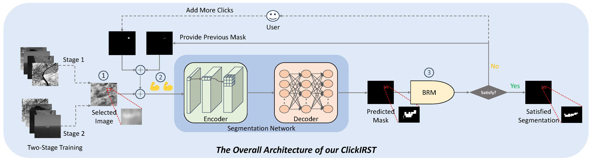

# ClickIRST: Towards Interactive Segmentation for Infrared Small Target🖱🖱


## Highlight
ClickIRST is an interactive annotation tool specifically designed for infrared small target (IRST) segmentation. It can be seamlessly integrated into any modern interactive segmentation framework to significantly enhance its suitability for the IRST task. With virtually no additional learnable parameters, the tool introduces no computational overhead, thereby enabling more efficient and accurate IRST annotation.



## Demo Video

https://github.com/user-attachments/assets/ed0911a1-95a1-4483-b041-0395353336e6


## Supplementary Video
In this video, we showcase the newly added functionalities of this annotation tool: 1) mask check option; 2) post-processing function option; 3) some keyboard shortcuts to facilitate fast annotation.

https://github.com/user-attachments/assets/eceef977-763b-406c-9461-5c8df2361cb2

- Press \<Esc> to reset clicks 
- Press \<R> to save current prediction mask
- Press \<Q> / \<E> to switch to previous/next image
- Press \<Space> to finish current object

## Environment
```
pip install -r requirements.txt
```

## Datasets
We used the WideIRSTD for both training and testing, SIRST3 only for testing.
- SIRST3: [download](https://drive.google.com/drive/folders/1NzH4KvpLeILqcchvkkKOdMGUr1svoR2F?usp=sharing)
- WideIRSTD: [download](https://drive.google.com/drive/folders/18Dxi0eB02WgQDjqTRQKgWhLl9PXgQ0vo?usp=sharing)

### Commands for runing demo
```
python demo.py --checkpoint=experiments/WideIRSTD_plainvit_base448/checkpoints/last_checkpoint.pth --gpu=0
```
  
### Commands for training
Before training, please download the [MAE](https://github.com/facebookresearch/mae) pretrained weights (click to download: [ViT-Base](https://dl.fbaipublicfiles.com/mae/pretrain/mae_pretrain_vit_base.pth)).
```
python train.py models/plainvit_base/plainvit_base448_WideIRSTD_itermask.py \
--batch-size=8 \
--gpus=0,1
```
### Commands for testing
  ```
  python scripts/evaluate_model.py --gpu=0 --checkpoint=experiments/ckick10/checkpoints/last_checkpoint.pth --eval-mode=cvpr --datasets=WideIRSTD
  ```

  ### Commands for ranking infrared image complexity
  ```
  python scripts/compute_irst_weights.py --dataset_path=WideIRSTD
  ```

## References

- The GUI tools uses [RITM](https://github.com/SamsungLabs/ritm_interactive_segmentation) for interactive image segmentation. This repository also contains a redistribution of their code in `gui/ritm`. That part of code follows RITM's license.
